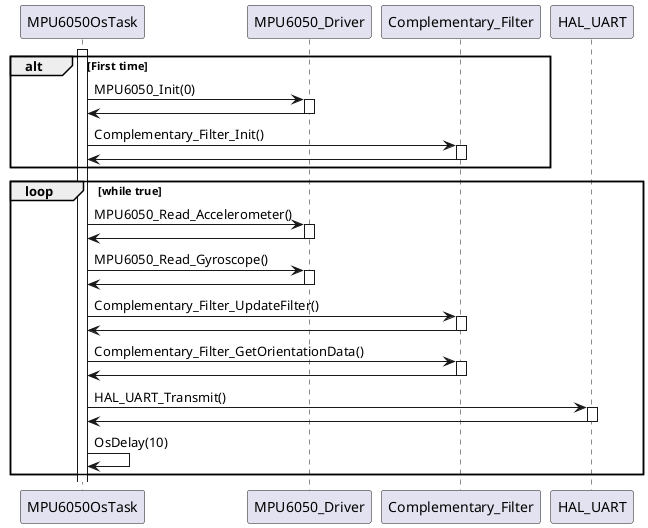

## Integration of the MPU6050 driver and the complementary filter
## Static connection diagram
## OsTask Sequence diagrams
### MPU6050OsTask 

```plantuml
@startuml
activate MPU6050OsTask
alt First time
    MPU6050OsTask -> MPU6050_Driver: MPU6050_Init(0)
    activate MPU6050_Driver
    MPU6050_Driver -> MPU6050OsTask
    deactivate MPU6050_Driver

    MPU6050OsTask -> Complementary_Filter: Complementary_Filter_Init()
    activate Complementary_Filter
    Complementary_Filter -> MPU6050OsTask
    deactivate Complementary_Filter
end
loop while true
    MPU6050OsTask -> MPU6050_Driver: MPU6050_Read_Accelerometer()
    activate MPU6050_Driver
    MPU6050_Driver -> MPU6050OsTask
    deactivate MPU6050_Driver
    MPU6050OsTask -> MPU6050_Driver: MPU6050_Read_Gyroscope()
    activate MPU6050_Driver
    MPU6050_Driver -> MPU6050OsTask
    deactivate MPU6050_Driver

    MPU6050OsTask -> Complementary_Filter: Complementary_Filter_UpdateFilter()
    activate Complementary_Filter
    Complementary_Filter -> MPU6050OsTask
    deactivate Complementary_Filter

    MPU6050OsTask -> Complementary_Filter: Complementary_Filter_GetOrientationData()
    activate Complementary_Filter
    Complementary_Filter -> MPU6050OsTask
    deactivate Complementary_Filter

    MPU6050OsTask -> HAL_UART: HAL_UART_Transmit()
    activate HAL_UART
    HAL_UART -> MPU6050OsTask
    deactivate HAL_UART

    MPU6050OsTask -> MPU6050OsTask: OsDelay(10)
end

@enduml
```